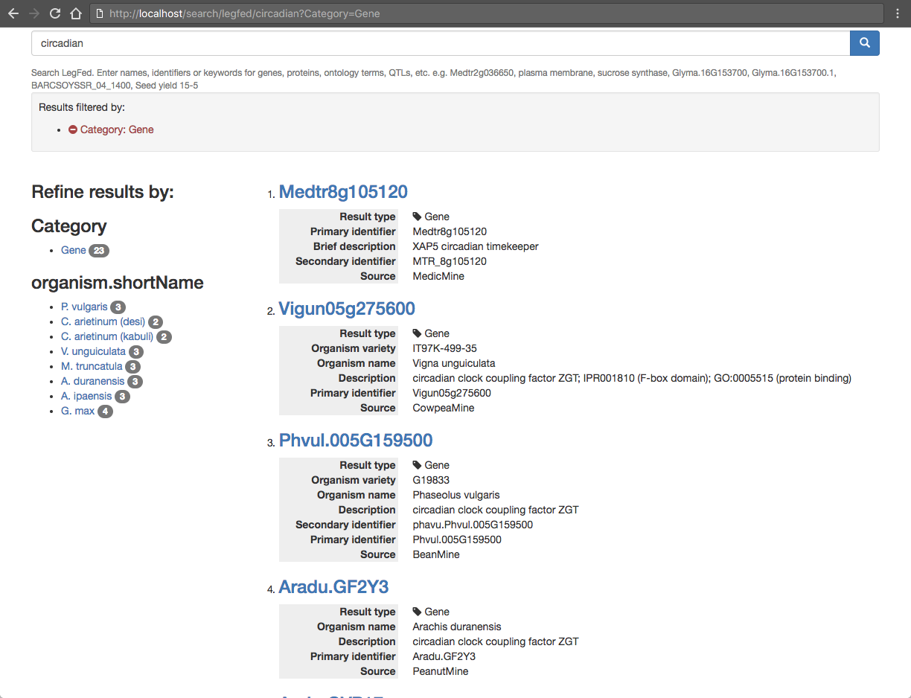

# intermine-search-drupal
Drupal module to enable searching one or more mine instances using InterMine Search API, collating the response into a faceted results page.

## Dependencies

* Font Awesome: https://www.drupal.org/project/fontawesome
* External Links: https://www.drupal.org/project/exlink

Note: The above dependencies will be automatically downloaded and installed, if not already available.

## Installation

1. On the command line, change directory to the location of your Drupal modules and clone the `intermine-search-drupal` git repository, like so:
```
$ cd /opt/www/MTGD/htdocs/tripal
$ cd sites/all/modules
$ git clone https://github.com/jcvi-plant-genomics/intermine-search-drupal.git intermine_search
```
2. On the Drupal modules page <http://localhost/admin/modules>, activate the "InterMine Search" module. This can also be done from the command-line via `drush`, like so (choose `y` to install all required dependencies):
```
$ drush pm-enable intermine_search
```
3. On the module configuration page <http://locahost/admin/config/search/intermine_search>, update the settings.
    - To point to your single InterMine instance (or a collection of InterMines). For example, MedicMine is configured like so:
      * `intermine_name`: **MedicMine**
      * `intermine_base_url`: **http://medicmine.jcvi.org/medicmine**
      * `intermine_search_examples`: **e.g. Medtr2g036650, plasma membrane, sucrose synthase**
    - To configure more than one remote InterMine instance, the URLs are represented as a JSON array like so:
      * `intermine_name`: **LegFed**
      * `intermine_base_url`:
          ```
            [{"intermine_base_url":"https://mines.legumeinfo.org/beanmine","intermine_name":"BeanMine"},
            {"intermine_base_url":"https://mines.legumeinfo.org/chickpeamine","intermine_name":"ChickpeaMine"},
            {"intermine_base_url":"https://mines.legumeinfo.org/cowpeamine","intermine_name":"CowpeaMine"},
            {"intermine_base_url":"http://medicmine.jcvi.org/medicmine","intermine_name":"MedicMine"},
            {"intermine_base_url":"https://mines.legumeinfo.org/peanutmine","intermine_name":"PeanutMine"},
            {"intermine_base_url":"https://mines.legumeinfo.org/soymine","intermine_name":"SoyMine"}]
          ```
      * `intermine_search_examples`: **e.g. Medtr2g036650, plasma membrane, sucrose synthase, Glyma.16G153700, Glyma.16G153700.1, BARCSOYSSR_04_1400, Seed yield 15-5**

    Click "Save Configuration" to store the settings in the database.

4. On the Drupal Search Settings page <http://localhost/admin/config/search/settings>, enable the "InterMine Search" module, set it as the "Default search module", and click "Save Configuration".

5. On the External Links module Settings page <http://localhost/admin/config/user-interface/extlink>, enable "Open external links in a new window", and click "Save Configuration".

## Usage

Any `%search_term%` passed to the URL (like so: <http://localhost/search/%intermine_name%/%search_term%>) will trigger a query against the Search API endpoints of one or all the configured InterMine instances. For example:

1. MedicMine: <http://localhost/search/medicmine/sucrose%20synthase>
2. LegFed: <http://localhost/search/legfed/circadian>

The results (returned in JSON format by the InterMine API) are used to populate a faceted, dynamic, search result page with contextual links to corresponding entities within the InterMine instances.


